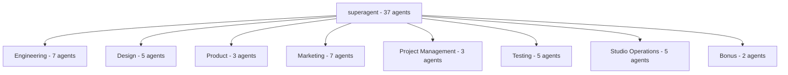

# superagent

A curated library of 37 specialized AI subagents for Claude Code, organized by department. Drop them into any project to extend Claude with domain-specific personas — from backend architecture and mobile development to growth marketing, legal compliance, and sprint planning.

---

## Overview

superagent is a collection of 37 AI subagent definitions organized for use with Claude Code. Each agent carries a focused system prompt that constrains its behavior to a specific discipline. Rather than prompting a general-purpose model repeatedly, you invoke the right specialist for each task.

32 agents use Claude Code's native YAML frontmatter format (with `name`, `description`, `tools`, and `color` fields) and load as subagents without modification. 5 agents in the marketing department use a prose layout (`## Description` / `## System Prompt` headers) and need frontmatter added before they register as Claude Code subagents.

The collection is structured around the operational departments of a lean product studio running 6-day development cycles: engineering, design, product, marketing, project management, testing, studio operations, and a bonus category.

---

## Highlights

- **37 agents across 8 departments** — covers the full lifecycle from prototyping to analytics, app store optimization to legal compliance review.
- **Claude Code native format** — 32 agents use YAML frontmatter that Claude Code reads directly; 5 marketing agents use a prose layout and need a small conversion before they register as subagents.
- **Scoped tool permissions per agent** — agents declare only the tools they need (e.g., `joker` only has `Write`; `frontend-developer` has `Write, Read, MultiEdit, Bash, Grep, Glob`), following least-privilege design.
- **6-day sprint model built in** — product, testing, and project-management agents reference the same weekly cadence, so cross-agent handoffs share a common vocabulary.
- **Mix-and-match composition** — agents are standalone files; use one, several, or all in the same project without configuration conflicts.
- **Immediately actionable descriptions** — every agent's `description` field includes concrete trigger examples so Claude knows exactly when to delegate to it.

---

## Agent Directory

### Engineering (7 agents)

| Agent | Specialty |
|-------|-----------|
| `ai-engineer` | LLM integration, RAG pipelines, recommendation systems, computer vision |
| `backend-architect` | API design, database schemas, microservices, security |
| `frontend-developer` | React, Vue, Angular, performance optimization, accessibility |
| `mobile-app-builder` | iOS, Android, React Native, Flutter, app store preparation |
| `devops-automator` | CI/CD pipelines, Terraform, Kubernetes, monitoring |
| `rapid-prototyper` | MVP scaffolding, trend integration, 6-day sprint delivery |
| `test-writer-fixer` | Unit, integration, and E2E test authoring and repair |

### Design (5 agents)

| Agent | Specialty |
|-------|-----------|
| `ui-designer` | Component systems, Tailwind-first layouts, mobile-first design |
| `ux-researcher` | User research, usability testing, journey mapping |
| `brand-guardian` | Brand consistency, visual identity, style guide enforcement |
| `visual-storyteller` | Data visualization, infographics, narrative design |
| `whimsy-injector` | Delightful micro-interactions, personality, surprise moments |

### Product (3 agents)

| Agent | Specialty |
|-------|-----------|
| `feedback-synthesizer` | Multi-source user feedback analysis, pattern extraction |
| `sprint-prioritizer` | RICE scoring, backlog triage, 6-day cycle planning |
| `trend-researcher` | Market trend analysis, competitive landscape, opportunity spotting |

### Marketing (7 agents)

| Agent | Specialty |
|-------|-----------|
| `content-creator` | Long-form articles, video scripts, cross-platform content |
| `growth-hacker` | Acquisition experiments, viral loops, conversion funnels |
| `app-store-optimizer` | ASO keyword research, listing copy, rating strategy |
| `instagram-curator` | Visual content, captions, Instagram-specific strategy |
| `tiktok-strategist` | Short-form video hooks, trend integration, creator workflows |
| `twitter-engager` | Thread writing, community engagement, platform voice |
| `reddit-community-builder` | Subreddit strategy, authentic community participation |

### Project Management (3 agents)

| Agent | Specialty |
|-------|-----------|
| `studio-producer` | Cross-team coordination, milestone tracking, resource allocation |
| `project-shipper` | Launch checklists, go-live readiness, deadline management |
| `experiment-tracker` | A/B test design, hypothesis tracking, results documentation |

### Testing (5 agents)

| Agent | Specialty |
|-------|-----------|
| `api-tester` | REST/GraphQL endpoint validation, contract testing |
| `performance-benchmarker` | Load testing, latency profiling, bottleneck identification |
| `test-results-analyzer` | Test suite health reporting, flakiness detection |
| `tool-evaluator` | Third-party tool assessment, build-vs-buy analysis |
| `workflow-optimizer` | Human-AI handoff efficiency, process automation |

### Studio Operations (5 agents)

| Agent | Specialty |
|-------|-----------|
| `analytics-reporter` | KPI dashboards, cohort analysis, A/B result interpretation |
| `finance-tracker` | Burn rate, revenue tracking, unit economics |
| `infrastructure-maintainer` | Server health, cost optimization, uptime monitoring |
| `legal-compliance-checker` | Privacy policies, GDPR/CCPA review, ToS analysis |
| `support-responder` | User support triage, response templates, escalation paths |

### Bonus (2 agents)

| Agent | Specialty |
|-------|-----------|
| `studio-coach` | Team morale, retrospectives, productivity coaching |
| `joker` | Tech humor, memorable 404 pages, morale boosts |

---

## Architecture



---

## How It Works

Claude Code supports subagents defined as Markdown files with YAML frontmatter. When you invoke an agent by name, Claude Code loads its system prompt and restricts available tools to those declared in the `tools` field. superagent provides pre-authored definitions for that format.

**Frontmatter schema:**

```yaml
---
name: backend-architect
description: When to invoke this agent and example triggers
color: purple
tools: Write, Read, MultiEdit, Bash, Grep
---

System prompt body follows...
```

- `name` — the identifier used to call the agent
- `description` — tells Claude Code when to delegate; includes concrete example conversations
- `color` — visual label in the Claude Code UI (optional on some agents)
- `tools` — comma-separated list of Claude Code tools the agent may use; omitted on some agents, meaning the host session's defaults apply

---

## Setup

**Prerequisites:** Claude Code installed and configured.

**Project-level installation** (agents available only in this project):

macOS / Linux (bash):
```bash
mkdir -p .claude/agents
cp agents-main/<department>/<agent-name>.md .claude/agents/
```

Windows (PowerShell):
```powershell
New-Item -ItemType Directory -Force -Path .claude\agents
Copy-Item agents-main\<department>\<agent-name>.md .claude\agents\
```

**Global installation** (agents available in every project):

macOS / Linux (bash):
```bash
mkdir -p ~/.claude/agents
cp agents-main/**/*.md ~/.claude/agents/
```

Windows (PowerShell):
```powershell
New-Item -ItemType Directory -Force -Path "$env:USERPROFILE\.claude\agents"
Get-ChildItem -Path agents-main -Recurse -Filter *.md |
  Copy-Item -Destination "$env:USERPROFILE\.claude\agents\"
```

After copying, restart your Claude Code session. Agents appear automatically — no registration step required.

> Note: The 5 marketing agents without YAML frontmatter (`content-creator`, `growth-hacker`, `instagram-curator`, `reddit-community-builder`, `twitter-engager`) need frontmatter added before Claude Code will recognize them as subagents. See the **Architecture** section for the required schema.
>
> There is no package.json, Makefile, or installer in this repository. The above commands follow the standard Claude Code subagent convention.

---

## Usage

Once agents are installed, reference them by name in any Claude Code conversation:

```
"We need to design the database schema for a multi-tenant SaaS product."
→ Claude delegates to backend-architect

"Add AI-powered search to the app."
→ Claude delegates to ai-engineer

"Plan our sprint — we have 14 open issues and 6 days."
→ Claude delegates to sprint-prioritizer

"Our onboarding flow has a 60% drop-off. What's going on?"
→ Claude delegates to feedback-synthesizer

"Set up a CI/CD pipeline that deploys on push to main."
→ Claude delegates to devops-automator
```

You can also invoke agents explicitly by mentioning their name, or allow Claude to select the best-fit agent based on the task description.

---

## Key Design Decisions

| Decision | Rationale | Tradeoff |
|----------|-----------|----------|
| One file per agent | Easy to copy, version, or share individual agents without taking the whole collection | No shared config or inheritance between agents |
| YAML frontmatter with prose body | Matches Claude Code's native subagent format exactly; no translation layer | Format must stay compatible with Claude Code's parser |
| Department-based folder structure | Mirrors how a product studio is organized; makes discovery intuitive | Agents that span departments (e.g., `workflow-optimizer`) require a judgment call on placement |
| Tool declarations per agent | Enforces least-privilege per domain — a joker agent cannot read files | Some agents omit `tools`, inheriting session defaults |
| Embedded trigger examples in `description` | Helps Claude Code infer when to auto-delegate without explicit invocation | Longer description fields increase frontmatter verbosity |

---

## Notable Engineering Agents

**`rapid-prototyper`** — the most comprehensive agent in the collection. Includes a full decision framework (virality vs. validation vs. investor demo), documented shortcuts with future refactoring notes, and a time-boxed 6-day delivery plan. Intentionally accepts technical debt in exchange for shipping velocity.

**`test-writer-fixer`** — goes beyond test generation. Includes a failure analysis protocol that distinguishes between outdated test expectations, brittle tests, and actual code bugs — and enforces a rule against weakening tests just to achieve a green build.

**`ai-engineer`** — covers RAG, semantic caching, model quantization, edge AI, and federated learning in a single agent. Includes cost optimization strategies (batch processing, smaller model selection) alongside ethical AI considerations (bias detection, explainable AI).

**`workflow-optimizer`** — targets human-AI collaboration specifically, with a 5-level efficiency model and concrete time-reduction targets (50% decision time reduction, 80% handoff delay reduction).

---

## Roadmap Ideas

- **Agent templates** — a starter `.md` file documenting the full frontmatter schema with inline comments, making it easier to author new agents.
- **Dependency declarations** — some workflows naturally chain agents (e.g., `rapid-prototyper` → `test-writer-fixer` → `devops-automator`). A `dependencies` field in frontmatter could formalize these handoffs.
- **Validation script** — a lightweight linter that checks each `.md` file for required frontmatter fields, valid tool names, and non-empty system prompts.
- **Per-stack variants** — language or framework-specific versions of `backend-architect` or `frontend-developer` (e.g., a Django-focused backend agent, a SwiftUI-focused mobile agent).
- **Agent composition guide** — documentation on which agent combinations work well together for common studio workflows (MVP launch, app store submission, post-launch iteration).

---

## About

This collection is designed for teams running rapid product development cycles — specifically the 6-day sprint model referenced throughout the agent system prompts. The agents share a common operational vocabulary (sprint weeks, launch readiness, user feedback loops) so they compose naturally within a single project context.

The `setup.md` file in the repository root contains a separate reference guide for configuring Claude Code, GitHub Copilot, and MCP servers in VS Code — supplementary reading for anyone building out a full AI-assisted development environment.
